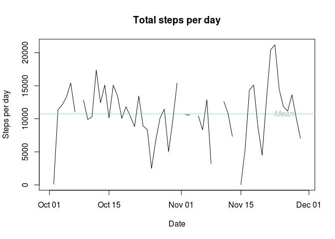
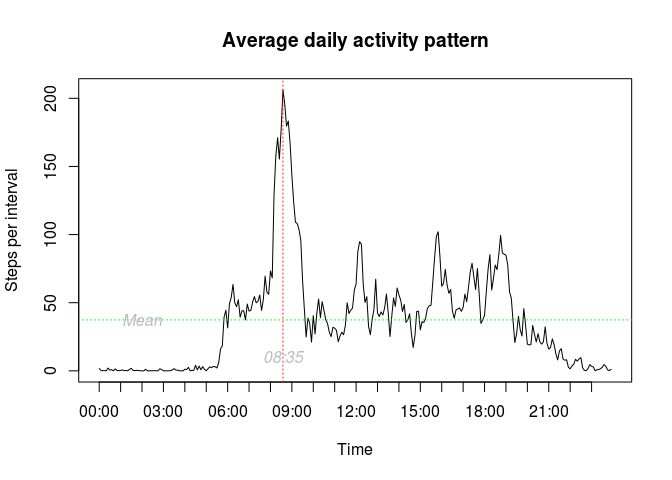
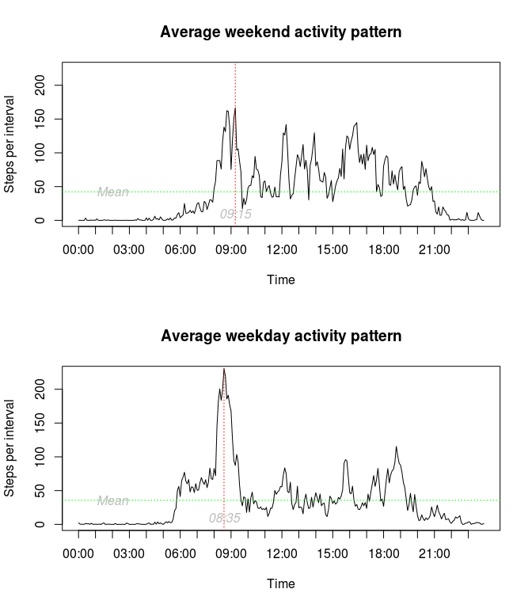

# Reproducible Research: Peer Assignment 1
ND  
16/08/2014  

This submission consists of a brief example of reproducible research using data from a personal activity monitoring device. The data consists of two months of step data from an anonymous individual collected during October and November 2012 and include the number of steps taken in 5 minute intervals each day.

## Loading and pre-processing the data

If the data hasn't already been downloaded the following code (not run) could be used to download the source .zip file then extract and load the .csv data.

```r
temp <- tempfile(fileext = ".zip")
url <- "https://d396qusza40orc.cloudfront.net/repdata%2Fdata%2Factivity.zip"
download.file(url, destfile = temp, method = "curl")
data <- read.csv(unzip(temp))
```

In our case however the data should already exist in the same directory as this .Rmd file, so it can be loaded directly from the .zip file. It is not necessary to explicitly set the working directory as each code chunk sets the working directory to the location of the .Rmd file.

```r
if (file.exists("activity.csv")) {
  data <- read.csv("activity.csv")
} else {
  data <- read.csv(unzip("activity.zip"))
}
```

Having loaded the data it can be processed for easier analysis. First the date strings are converted into date type variables then a new variable is created containing the day name corresponding to each date. Since the interval values are integers representing time in five minute intervals they can be converted into time strings and then combined with the dates into a POSIXct type datetime variable.

```r
data$date <- as.Date(data$date)
data$day <- factor(format(data$date,format="%a"),
                   levels = c("Mon", "Tue", "Wed", "Thu", "Fri", "Sat", "Sun"))
# pad string with leading zeros to get four digits:
data$interval <- sprintf("%04d", data$interval)
# insert a : after the first two digits:
data$interval <- gsub('^([0-9]{2})([0-9]+)$', '\\1:\\2', data$interval)
# concatenate date and time strings into a usable datetime variable:
data$datetime <- as.POSIXct(paste(data$date,data$interval))
```

## Mean number of steps per day

In order to calculate the mean and median number of steps per day it is convenient to create a new dataframe containing the number of steps each day. The following code chunk demonstrates just one of many ways to do this. In addition to the sum of steps, the count of missing values is also determined.

```r
daily <- data.frame(
  steps = tapply(data$steps, data$date, sum, na.rm = FALSE),
  missing = tapply(data$steps, data$date, function(x) sum(is.na(x))),
  date = unique(data$date)
  )
```

Having created the daily dataframe, it's straightforward to determine the mean and median total number of steps taken per day.

```r
daily.mean <- mean(daily$steps, na.rm = TRUE)
daily.median <- median(daily$steps, na.rm = TRUE)
```

The **mean number of steps per day is 10766** and the **median number of steps per day is 10765**. The following histogram illustrates the variability in the number of steps per day (NB a bin width of 2500 has been specified rather than relying on the default bin width).

```r
hist(daily$steps, xlab = "Steps per day", main = "Total steps per day",
     breaks = seq(min(daily$steps, na.rm=TRUE), max(daily$steps, na.rm=TRUE) + 2500, by = 2500))
```

 

The following time series plot of steps per day by date provides a further way of looking at the variability in the data.

```r
plot(y = daily$steps, x = daily$date, type = "l", main = "Total steps per day",
     ylab = "Steps per day", xlab = "Date")
# add a labelled horizontal line at the mean value:
abline(h = daily.mean, col = "green", lty = 3)
text(x = max(daily$date) - 5, y = daily.mean,
     labels = "Mean", col = "grey", font = 3)
```

 

## Average daily activity pattern

The average daily activity pattern can be found by taking the average number of steps at each measurement interval throughout the day. A new dataframe is created containing this typical day information.

```r
typical <- data.frame(
  steps = tapply(data$steps, data$interval, mean, na.rm=TRUE),
  interval = unique(data$interval)
)
```

It is possible to identify the interval that, on average, contains the maximum number of steps.

```r
max.interval <- which.max(typical$steps)
```

This **maximum number of steps per interval occurs at 08:35**, as shown on the following annotated time series plot.

```r
 # plot the daily profile without an x-axis:
  plot(typical$steps, type = "l", xaxt = "n", main = "Average daily activity pattern",
       ylab = "Steps per interval", xlab = "Time")
  # add a labelled x-axis showing hourly invervals:
  daily.intervals <- unique(data$interval)
  axis(1, at = seq(1, 288, by = 12),
       labels = daily.intervals[seq(1, 288, by = 12)])
  # add a labelled horizontal line at the mean value:
  abline(h = mean(typical$steps), col = "green", lty = 3)
  text(x = 25,y = mean(typical$steps),
       labels = "Mean", col = "grey", font = 3)
  # add a labelled vertical line at the time of maximum value:
  abline(v = max.interval, col = "red", lty = 3)
  text(x = max.interval, y = 10,
       labels = names(max.interval), col = "grey", font = 3)
```

 

## Imputing missing values

The sum of the logical values returned by `is.na()` is used to count the number of missing values in the original dataset. 

```r
missing.count <- sum(is.na(data$steps))
```

This tells us **there are 2304 missing values in the original dataset**. The days containing missing values and the number of missing values per day can be obtained from the daily dataframe.

```r
daily$missing[daily$missing > 0]
```

```
## 2012-10-01 2012-10-08 2012-11-01 2012-11-04 2012-11-09 2012-11-10 
##        288        288        288        288        288        288 
## 2012-11-14 2012-11-30 
##        288        288
```

The days with missing values are all missing 288 five-minute intervals, i.e. a whole day of values. A simple general strategy is used for imputing these missing values; If an interval value is missing it will be replaced with the corresponding interval value from the typical (average) daily profile. This strategy can handle days missing any number of interval values.

The following code chunk first creates a vector indicating the missing values, then makes a copy of the original data and finally replaces each missing value in the copy with the value for the corresponding five minute interval from the typical day.

```r
missing <- which(is.na(data$steps))
data.imp <- data
for (i in 1:length(typical$interval)) {
  data.imp[missing,]$steps[data.imp[missing,]$interval == typical$interval[i]
                           ] <- typical$steps[typical$interval == typical$interval[i]]
}
```

To investigate the affect of imputing missing values on the mean, median and distribution of average steps per day another daily average dataframe is created from the imputed dataset.

```r
daily.imp <- data.frame(
  steps = tapply(data.imp$steps, data.imp$date, sum, na.rm = FALSE),
  missing = tapply(data.imp$steps, data.imp$date, function(x) sum(is.na(x))),
  date = unique(data.imp$date)
  )
daily.imp.mean <- mean(daily.imp$steps, na.rm = TRUE)
daily.imp.median <- median(daily.imp$steps, na.rm = TRUE)
```

From the imputed dataset, the **mean number of steps per day is 10766** and the **median number of steps per day is 10766** These are virtually the same as the original dataset however the distribution may have changed. The following histograms illustrate the difference in distribution between the two datasets. The histograms are plotted side by side by setting `par(mfrow=c(1,2))`.

```r
par(mfrow=c(1,2))

hist(daily$steps, xlab = "Steps per day", main = "Total steps per day", ylim = c(0,30),
     breaks = seq(min(daily$steps, na.rm=TRUE), max(daily$steps, na.rm=TRUE) + 2500, by = 2500))

hist(daily.imp$steps, xlab = "Steps per day", main = "Total steps per day (imputed)", ylim = c(0,30),
     breaks = seq(min(daily.imp$steps, na.rm=TRUE), max(daily.imp$steps, na.rm=TRUE) + 2500, by = 2500))
```

 

The histograms suggests that the modal (i.e. most frequently occurring) value has increased in the imputed dataset, without any change in the other values. This is because the original dataset is missing whole days of data and the imputation strategy simply replaces these missing days with average days, thus increasing the occurrence of average days in the imputed dataset.

## Differences between weekday and weekend activity patterns

To compare the differences in activity pattern between weekdays and weekends two typical days are created, one for weekdays and one for weekends. Firstly a logical vector is created indicating if the day is a Saturday or a Sunday, these TRUE values are assigned the string "Weekend, and the FALSE values are assigned the string "Weekday". The resulting character vector is then converted to factors and added to a new column in the imputed dataset.

```r
weekend <- (data.imp$day == "Sat" | data.imp$day == "Sun")
weekend[weekend == TRUE] <- "Weekend"
weekend[weekend == FALSE] <- "Weekday"
data.imp$daytype <- as.factor(weekend)
```

The two typical days are created the same way as before, only this time the data is subset by daytype.

```r
typical.weekend <- data.frame(
  steps = tapply(data.imp[data.imp$daytype == "Weekend", ]$steps,
                 data.imp[data.imp$daytype == "Weekend", ]$interval, mean, na.rm=TRUE),
  interval = unique(data.imp[data.imp$daytype == "Weekend", ]$interval)
)
typical.weekday <- data.frame(
  steps = tapply(data.imp[data.imp$daytype == "Weekday", ]$steps,
                 data.imp[data.imp$daytype == "Weekday", ]$interval, mean, na.rm=TRUE),
  interval = unique(data.imp[data.imp$daytype == "Weekday", ]$interval)
)
```

The weekend and weekday activity patterns can be compared in the following plots, created in a similar way to the the previous activity pattern plot, but faceted by combining two plots together. This effect is achieved in base R by setting `par(mfcol=c(2,1))`.

```r
par(mfrow=c(2,1))

max.interval <- which.max(typical.weekend$steps)
 # plot the daily profile without an x-axis:
  plot(typical.weekend$steps, type = "l", xaxt = "n", main = "Average weekend activity pattern",
       ylab = "Steps per interval", xlab = "Time", ylim = c(0,225))
# add a labelled x-axis showing hourly invervals:
  daily.intervals <- unique(data.imp$interval)
  axis(1, at = seq(1, 288, by = 12),
       labels = daily.intervals[seq(1, 288, by = 12)])
# add a labelled horizontal line at the mean value:
  abline(h = mean(typical.weekend$steps), col = "green", lty = 3)
  text(x = 25,y = mean(typical.weekend$steps),
       labels = "Mean", col = "grey", font = 3)
  # add a labelled vertical line at the time of maximum value:
  abline(v = max.interval, col = "red", lty = 3)
  text(x = max.interval, y = 10,
       labels = names(max.interval), col = "grey", font = 3)

max.interval <- which.max(typical.weekday$steps)
 # plot the daily profile without an x-axis:
  plot(typical.weekday$steps, type = "l", xaxt = "n", main = "Average weekday activity pattern",
       ylab = "Steps per interval", xlab = "Time", ylim = c(0,225))
  # add a labelled x-axis showing hourly invervals:
  daily.intervals <- unique(data.imp$interval)
  axis(1, at = seq(1, 288, by = 12),
       labels = daily.intervals[seq(1, 288, by = 12)])
  # add a labelled horizontal line at the mean value:
  abline(h = mean(typical.weekday$steps), col = "green", lty = 3)
  text(x = 25,y = mean(typical.weekday$steps),
       labels = "Mean", col = "grey", font = 3)
  # add a labelled vertical line at the time of maximum value:
  abline(v = max.interval, col = "red", lty = 3)
  text(x = max.interval, y = 10,
       labels = names(max.interval), col = "grey", font = 3)
```

 

There is a more pronounced peak in the weekday activity pattern, occurring between 8:30 and 8:35. After this morning peak there appears to be fewer steps per interval than on the weekend activity profile. It is difficult to make much inference from these average profiles however the weekday morning peak might correspond to a running or walking commute, with less subsequent activity during working hours than on weekends. Further investigation could consider the variance in daily totals as well as in steps at each interval in the activity profiles.
